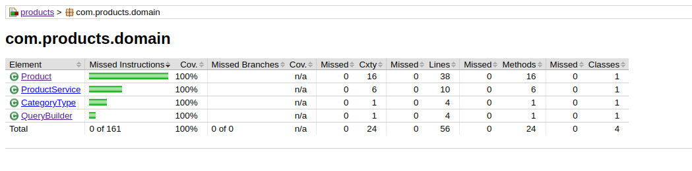

# Products Microservice API (ms-products-api)

## 💻 Project

The project is highly focused on ensuring code quality and reliability
through a wide range of **automated tests**, including **unit** tests,
**integration**, **end-to-end** and **mutant** testing. Use Jacoco for coverage analysis
of tests. Technologies used include Spring Boot Test, JUnit 5, Mockito,
AssertJ, Hamcrest, JsonPath, Jacoco and Pitest.

## ✨ Technologies

- [Mysql](https://dev.mysql.com/downloads/mysql/)
- [Java](https://www.oracle.com/java/technologies/downloads/)
- [Maven](https://maven.apache.org/download.cgi)
- [Spring Boot](https://spring.io/projects/spring-boot)
- [Spring Testing](https://docs.spring.io/spring-framework/docs/current/reference/html/testing.html#testing-introduction)
- [JUnit 5](https://junit.org/junit5/docs/current/user-guide/)
- [Mockito](https://site.mockito.org)
- [AssertJ](https://github.com/assertj/assertj)
- [Hamcrest](http://hamcrest.org/JavaHamcrest/)
- [Jacoco](https://github.com/jacoco/jacoco)
- [Pitest](https://pitest.org)

## 🐳 Database with Docker

To start the database with Docker, run:
    
    $ docker-compose up -d

## 🛠️ Build and Run

- Have maven installed

- To build and run all tests, run the command:

      mvn clean verify

- Run Only Integration Tests:

      mvn clean verify -Dsurefire.skip=true

- To run just the unit tests, run:

      mvn clean verify -DskipITs=true

- To run mutant coverage tests, run:

      mvn test-compile org.pitest:pitest-maven:mutationCoverage

## Test coverage

### General coverage

### Domain testing coverage

### Web testing coverage

### Mutant testing coverage with Pitest
